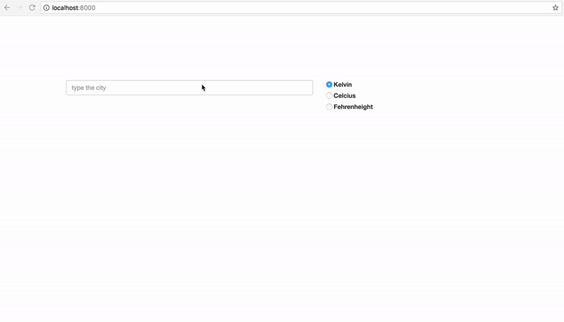

# React Task

## Objective
Build a React App that shows current weather in given cities with different temperature units. You can see a demo of working result below:

*Workflow*

* User inputs city name into box
* When user hits enter, city name and temperature appears in the list below, with the active temperature unit
* When user changes temperature unit, list updates consequently
* User can remove any of the city from the list by clicking the "minus" icon in front of the city name

## Resources

#### Data
Get the data from [Open Weather Map](http://openweathermap.org) via API. You can find a API key in `api.txt`

#### Boilerplate
Use Facebook's `create-react-app` to create a project: https://github.com/facebookincubator/create-react-app

#### Bonus
* Using a `react-redux` would be a plus for your application
